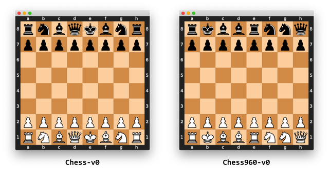

# Chess Gym Environment

<a href="https://imgbb.com/"></a>
## Overview
This project provides a custom Chess environment compatible with Farama Foundation Gymnasium. It allows for training and evaluating reinforcement learning (RL) agents in chess-based scenarios. The environment includes multiple observation and action wrappers to support different input representations and interaction methods.


## Features
- Standard Chess environment following Farama Foundation Gymnasium API
- Single-player mode with a custom or random opponent
- Multiple observation wrappers:
  - One-hot encoded board state
  - Piece map representation
  - FEN notation
  - RGB image representation
- Action wrappers supporting UCI notation
- Render support for human-readable board visualization

## Installation
To install the Chess Gym environment, clone this repository and install the required dependencies:

```bash
git clone https://github.com/RobinU434/chess_gym
cd chess_gym 
poetry install  
```

## Usage
### Creating and Interacting with the Environment
```python
from chess_gym.chess_env import ChessEnv

env = ChessEnv(render_mode="rgb_array")
obs, info = env.reset()
print("Initial observation:", obs)

# Take a random action ...
action = env.action_space.sample()
obs, reward, terminated, truncated, info = env.step(action)
print("Next observation:", obs)
print("Reward:", reward)

# or make use of allowed actions
available_actions = info["available_actions"]
action = available_actions[np.random.choice(len(available_actions))]
obs, reward, terminated, truncated, info = env.step(action)
print("Next observation:", obs)
print("Reward:", reward)

env.close()
```

### Using Wrappers
The environment can be wrapped with various observation and action wrappers:
```python
from chess_gym.wrappers import PieceMapWrapper, FenObsWrapper, RBGObsWrapper, UCIActionWrapper

env = ChessEnv()
env = FenObsWrapper(env)
env = UCIActionWrapper(env)

obs, info = env.reset()
uci_action = "e2e4"
obs, reward, terminated, truncated, info = env.step(uci_action)
print("Played move:", uci_action)
print("Updated Board FEN:", env.board.fen())

env.close()
```

### Using Single Player Env

```python
from chess_gym.chess_env import SinglePlayerChess

env = SinglePlayerChess(render_mode="rgb_array")
obs, info = env.reset(player_starts=False)
```

### Chess 960
There is also an environment for the Chess960 variant. You can add it modified the existing class as `ChessEnv(chess960=True)`

<a href="https://ibb.co/dgLW9rH"></a>

## Further Info
This environment will return 0 reward until the game has reached a terminal state. In the case of a draw, it will still return 0 reward. Otherwise, the reward will be either 1 or -1, depending upon the winning player.
```python
observation, reward, terminal, truncated, info = env.step(action)
```
Here, `info` will be a dictionary containing the following information pertaining to the board configuration and game state:
* [`next_turn`](https://python-chess.readthedocs.io/en/latest/core.html#chess.Board.turn): The side to move (`chess.WHITE` or `chess.BLACK`).
* [`castling_rights`](https://python-chess.readthedocs.io/en/latest/core.html#chess.Board.castling_rights): Bitmask of the rooks with castling rights.
* [`fullmove_number`](https://python-chess.readthedocs.io/en/latest/core.html#chess.Board.fullmove_number): Counts move pairs. Starts at 1 and is incremented after every move of the black side.
* [`halfmove_clock`](https://python-chess.readthedocs.io/en/latest/core.html#chess.Board.halfmove_clock): The number of half-moves since the last capture or pawn move.
* [`promoted`](https://python-chess.readthedocs.io/en/latest/core.html#chess.Board.promoted): A bitmask of pieces that have been promoted.
* [`ep_square`](https://python-chess.readthedocs.io/en/latest/core.html#chess.Board.ep_square): The potential en passant square on the third or sixth rank or `None`.
* `available_actions`: vector of discrete actions pointing our which actions are available for the next move
* `available_uci_actions`: vector of discrete uci actions pointing our which actions are available for the next move


## License
This project is licensed under the MIT License. See the LICENSE file for details.

## Contributing
Contributions are welcome! Feel free to submit issues or pull requests.

## Contact
For any questions or support, please open an issue or reach out via email.

